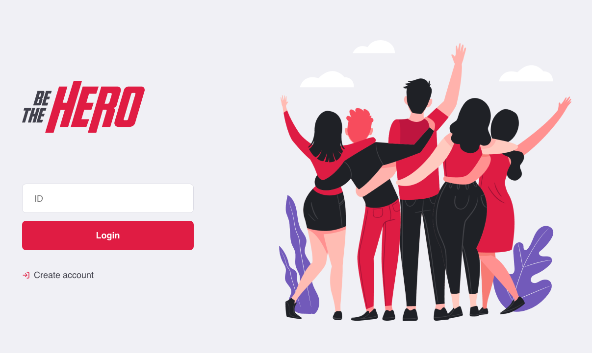
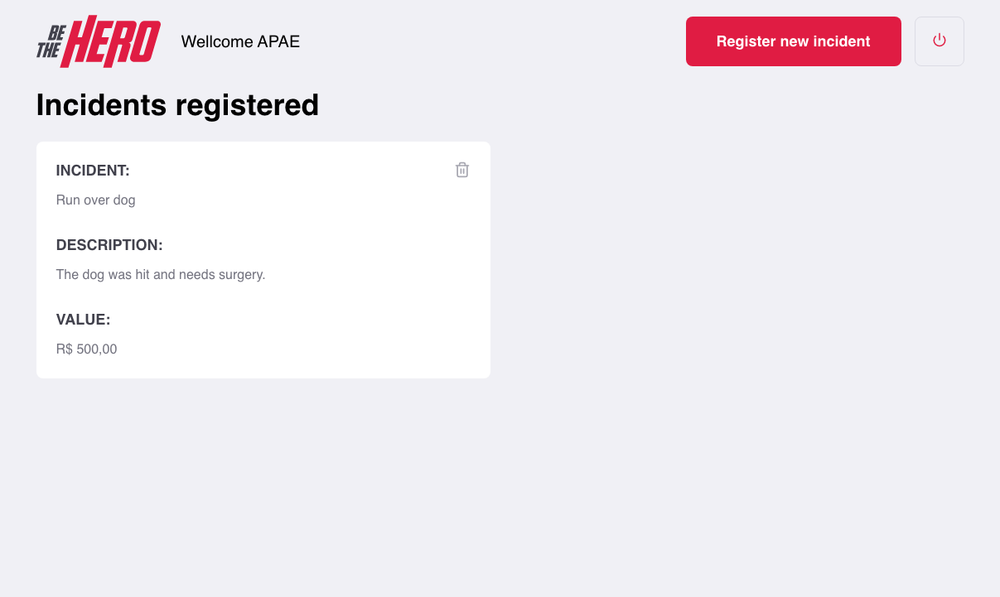
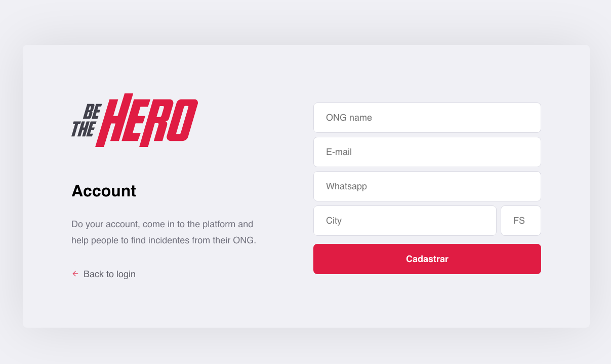
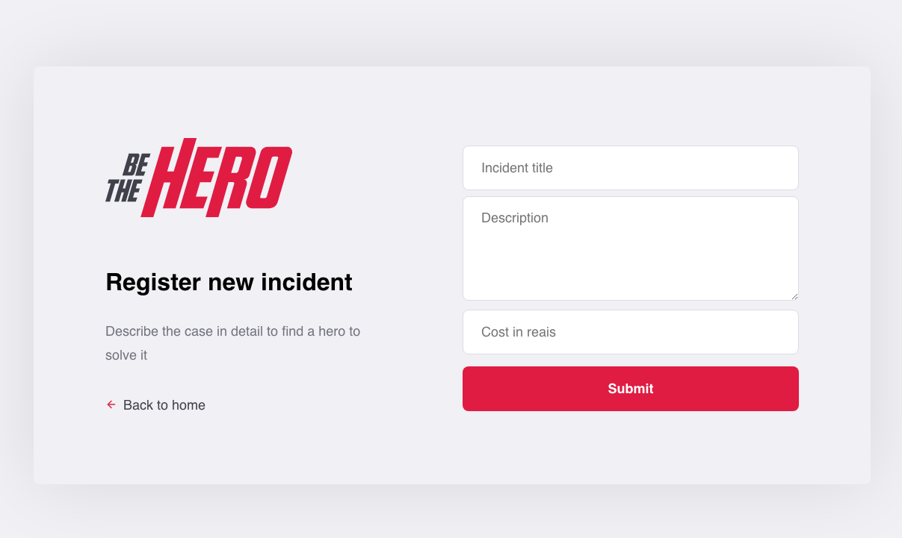
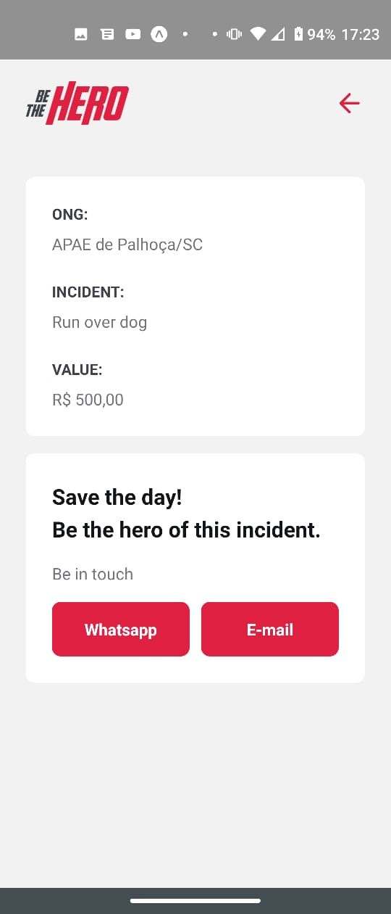

<h1 align="center">
    
    <br>
    Be The Hero Web
</h1>

<h4 align="center">
  An web app for ONGs register some incidents that happened, await for a hero to help, and the mobile app for the heros how want to help with any case available.
</h4>
<p align="center">
  
  
  
  
  <a href="https://www.codacy.com/manual/JeisonJHA/be-the-hero?utm_source=github.com&amp;utm_medium=referral&amp;utm_content=JeisonJHA/be-the-hero&amp;utm_campaign=Badge_Grade">
    
  </a>
  
  
  <a href="https://github.com/jeisonjha/be-the-hero/commits/master">
    
  </a>
  
  <a href="https://github.com/jeisonjha/be-the-hero/issues">
    
  </a>
  
     
</p>

<p align="center">
  <a href="#rocket-technologies">Technologies</a>&nbsp;&nbsp;&nbsp;|&nbsp;&nbsp;&nbsp;
  <a href="#information_source-how-to-use">How To Use</a>&nbsp;&nbsp;&nbsp;|&nbsp;&nbsp;&nbsp;
  <a href="#memo-license">License</a>
</p>

<p align="center">
  <h4 align="center">Web app</h4>
  <div align="center">
       
       
       
       
  </div>
  <h4 align="center">Mobile app</h4>
  <div align="center">
       
       
  </div>
</p>

## :rocket: Technologies

This project was developed at the [RocketSeat Semana Omnistack](https://rocketseat.com.br) with the following technologies:
## Web App
- [ReactJS](https://reactjs.org/)
- [Create React App Configuration Override](https://github.com/sharegate/craco)
- [React Router v4](https://github.com/ReactTraining/react-router)
- [styled-components](https://www.styled-components.com/)
- [Axios](https://github.com/axios/axios)
- [History](https://www.npmjs.com/package/history)
- [React-Icons](http://react-icons.github.io/react-icons/)
- [VS Code][vc] with [EditorConfig][vceditconfig] and [ESLint][vceslint]

## Mobile App
- [ReactNative](https://reactnative.dev)
- [Expo](https://expo.oi)
- [Expo Mail Composer](https://docs.expo.io/versions/latest/sdk/mail-composer/)
- [React Navigation](https://reactnavigation.org/)
- [Axios](https://github.com/axios/axios)
- [VS Code][vc] with [EditorConfig][vceditconfig] and [ESLint][vceslint]
information_source-how-to-use
## :information_source: How To Use

To clone and run this application, you'll need [Git](https://git-scm.com), [Node.js v10.16][nodejs] or higher + [Yarn v1.13][yarn] or higher installed on your computer. From your command line:

```bash
# Clone this repository
$ git clone https://github.com/jeisonjha/be-the-hero

# Go into the repository
$ cd be-the-hero

# Install each folder separately
$ ./backend yarn install
$ ./forntend yarn install
$ ./mobile yarn install

# Run the app on each folder
$ yarn start
```

## :memo: License

This project is under the MIT license. See the [LICENSE](https://github.com/jeisonjha/be-the-hero/blob/master/LICENSE) for more information.

---

Made by Jeison Azevedo :wave: [Get in touch!](https://www.linkedin.com/in/jeison-azevedo/)

[nodejs]: https://nodejs.org/
[yarn]: https://yarnpkg.com/
[vc]: https://code.visualstudio.com/
